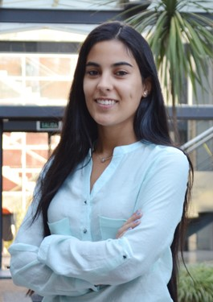



<!---->



<!---->

<!--

<!-- -->
 

I am a fifth-year Ph.D.Candidate in the Department of Economics at University of Oregon. I study development and labor economics utilizing married of applied microeconometric techniques. I focus on issues relating to family policies, financial inclusion and crime.

  Fields of Study: Development Economics, Labor Economics, Applied Econometrics, Gender Economics.

  I will be available on the job market in the 2020-2021 academic year. 



